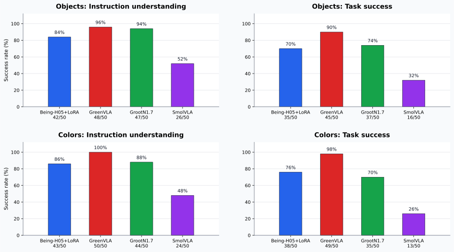

# Cobot Magic Fine-Tuning



*Real-world benchmark results for the evaluated Cobot Magic policies.*

This repository contains fine-tuning integrations for the Cobot Magic LeRobot dataset. It keeps four model pipelines side by side so the same dataset can be tested with OpenVLA-OFT, NVIDIA Isaac-GR00T N1.7, LeRobot SmolVLA, and Being-H05.

Current training uses only the 14D bimanual joint state/action (`all_arms`).

> **Evaluation status:** OpenVLA-OFT is included as a complete training and inference integration, but it was not evaluated in the real-world benchmark shown above. The reported comparison therefore covers only the models for which robot-test results were collected.

## Structure

```text
openvla-oft/       # OpenVLA-OFT integration: LeRobot loader, DDP/FSDP training and ZMQ inference
Isaac-GR00T/       # Isaac-GR00T integration: Cobot Magic modality config, distributed training and ZMQ inference
lerobot/           # LeRobot SmolVLA integration
Being-H/           # Being-H05 integration: Cobot Magic modality config, FSDP launch commands
realworld_benchmark_summary.svg
```

## Read Next

- [OpenVLA-OFT instructions](openvla-oft/README.md)
- [Isaac-GR00T instructions](Isaac-GR00T/README.md)
- [LeRobot SmolVLA instructions](lerobot/README.md)
- [Being-H05 instructions](Being-H/README.md)